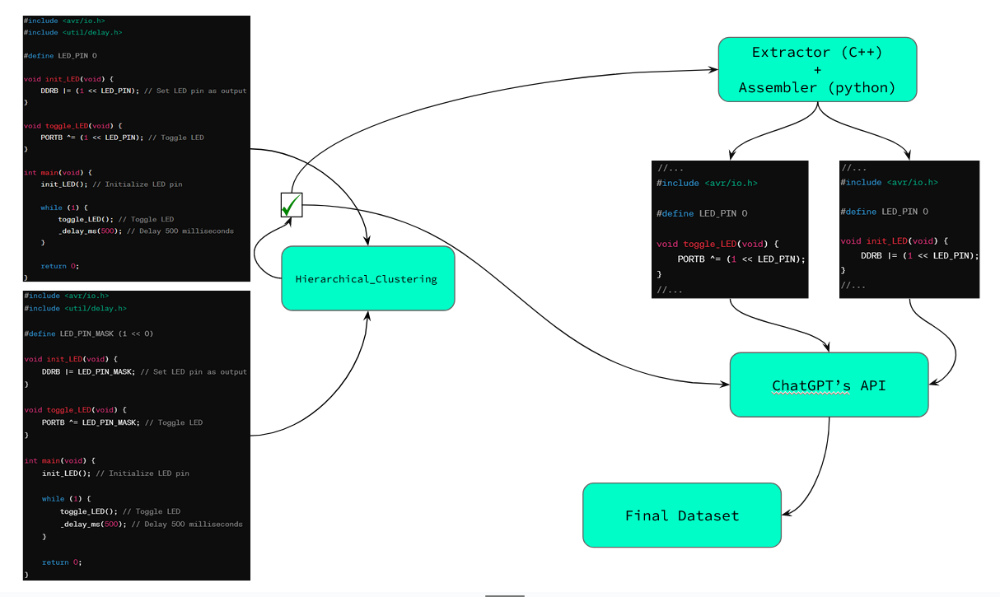
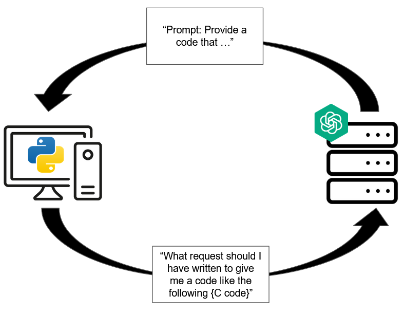
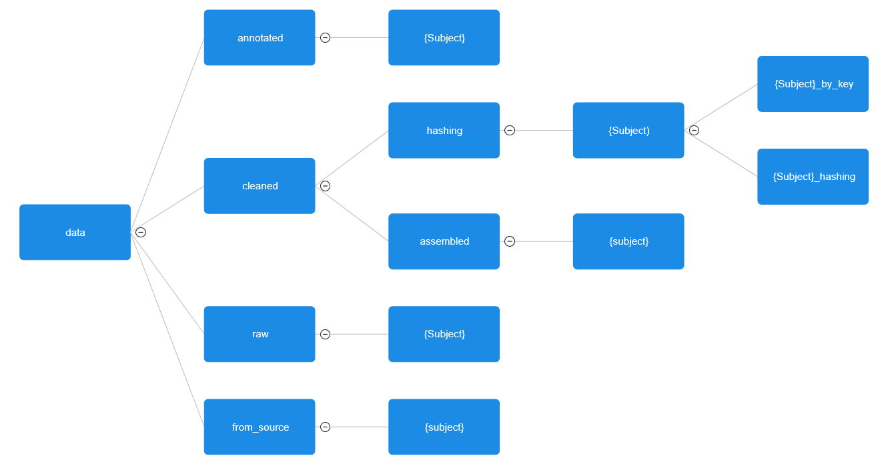
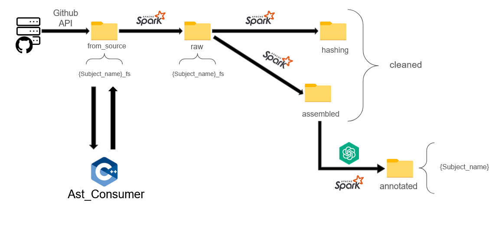

# Content
This an implementation of Spark jobs that perform the deduplication, cleaning, hashing, assembling, and annotation of code snippets related to embedded programming in C

# Steps
## Step 1: from Source to Raw
In this step, deduplication is performed on the code snippets.

This code tries to identify the files containing representative codes, making a set of files names, from which no two correpond to codes doing the same thing/having the same structure. 
The output data is stored in the "raw" folder. 

Corresponding file: "from_source_to_raw.py".

## Step 2: from Raw to Clean
This step procures all the final code data instances (not annotated).
### substep 1: Hashing:
This Spark job references every parent code to its subsidiaries, through a key that is unique to each parent code.
Parent Codes being the representative codes references in the folder in "/raw".

The output data is stored in the "cleaned/hashing" folder. 

Corresponding file: "raw_to_clean_1.py"

### Substep 2: Assembling: 
This Spark job reconstructs every extracted code into its original context as coherent portion of code (adding global variables, defining custom types...), the extracted codes need their parents code for that, hence, the hashing done in the first substep.
The output data is stored in the "cleaned/assembeled" folder. 

Corresponding file: "raw_to_clean_2.py"

## Step 3: from Clean to Annotated
In this step our code snippets are annotated, by a prompt that the user could give to the model so the latter can procure an answer.

A request is sent for each code snippet to the OpenAI API in order to provide its annotation.
The output data is stored in the "annotated" folder.

Corresponding file: "clean_to_anno.py"

# Usage
- The path to the data directory must be set at the beginning of all Spark jobs.

(data ->{from_source->{subjects}, raw->{subjects_fs}, cleaned->{subject->{subject_by_key, subject_hashing}}, annotated->{subjects})

- For the third step, an OpenAI API key needs to be set in the Spark configuration.

