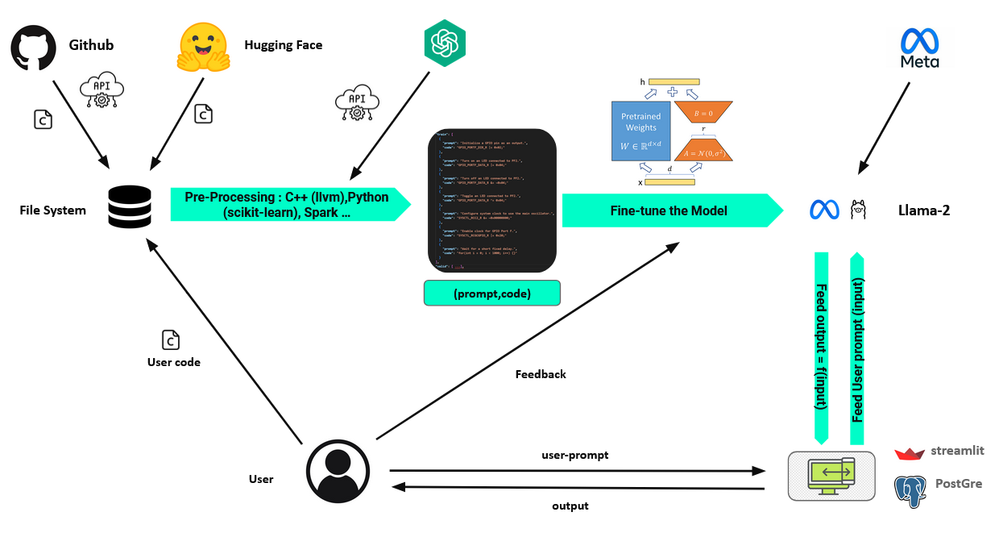

# ProjetLong
This repository contains everything about a project done by HALILOUA Othmane, EL ALOUT Ismail, LAHMOUZ Zakaria, EL HABTI Ouassel, and KARMAOUI Oussama, under the supervision of one of IRIT's heads of reasearch Mr CHAARI Lotfi.

# Content:
Data, contains the final data instances, structred and stored in a CSV Format.

Code, contains all the software developments (data engineering, data science, web development).

In each folder you'll have a documentation explaining how everything works, and how you can run it on your machine.

The following image provides a technical overview of the project. (tools, architecture, ...)

!
